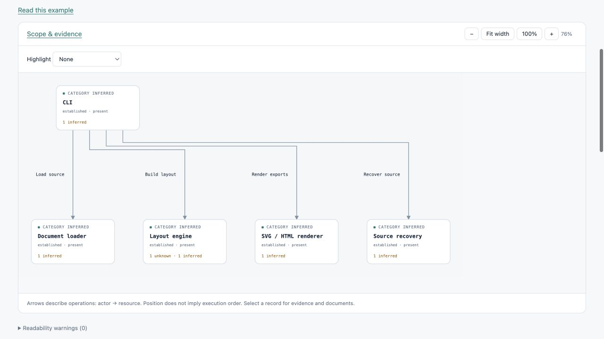

# Waxwing

**Inspectable architecture diagrams for humans and coding agents.**

Turn a structured system model into interactive diagrams with linked documentation,
source evidence, and explicit unknowns. Export portable HTML and SVG with the
model included.

[Explore the live demo](https://pavelnedved.github.io/waxwing/) ·
[Agent guide](AGENT_GUIDE.md) · [Examples](docs/features.md) ·
[Contributing](CONTRIBUTING.md)



Waxwing is an early, personally maintained project. The formats are experimental;
validation checks structure and consistency, not whether your evidence is true.
The first npm release is being prepared. The checkout quickstart below works now.

## Try it

Requires Node.js **20.19.0 or newer**. No server or account is needed to view the
exported diagrams.

```sh
git clone https://github.com/pavelnedved/waxwing.git
cd waxwing
npm ci
npm run demo:self
```

Open `examples/waxwing/generated/index.html` in your browser. This real example
models [a pinned revision of Waxwing itself](examples/waxwing/README.md):

1. Open **Waxwing: from model to artifact** and select **Layout engine** to inspect its claims.
2. Follow **Inside architecture layout** to see the coordinator, validators, and ELK boundary.
3. Open **A successful architecture build** for the explicit call order, then **Read this example** for the explanation and source links.

The graph describes dependencies; the workflow describes a scoped successful
execution path. Both retain the underlying component identities and evidence.

## Use it with your coding agent

Give your agent [AGENT_GUIDE.md](AGENT_GUIDE.md), access to the code you want to
understand, and a concrete question:

> Use the Waxwing agent guide to explain how this repository handles an incoming
> request. Inspect the code, create a partial architecture model with evidence
> linked to the source revision, and preserve unknowns. Validate the model and
> build an HTML diagram in a separate output directory.

The guide contains complete authoring examples and commands. You choose the
agent; Waxwing's layout and rendering do not call an LLM. There is no built-in
repository crawler or `ingest` command.

From the checkout, build the model your agent produces:

```sh
node bin/waxwing.mjs build /path/to/model.json /path/to/output
```

Open `output/diagram.html`. It contains the diagram, its inspector, registered
Markdown documents, and the source model. Share that HTML file as an attachment,
or use `build-site` to generate linked pages for static hosting.

## What you can inspect

- **Architecture and subgraphs:** move between an overview and selected internals.
- **Workflows and sequences:** follow explicit ordering, replies, loops, and alternatives.
- **Evidence and uncertainty:** inspect why a claim exists and what remains unknown or disputed.
- **Linked Markdown:** navigate between explanations and specific diagram records.
- **Recoverable source:** extract the complete embedded model from supported exports.

```sh
node bin/waxwing.mjs recover /path/to/diagram.html /path/to/recovered-model.json
```

Recovery preserves the parsed source model; it does not authenticate the original
claims or certify that an exported drawing has not been altered.

## Documentation and development

- [Feature walkthroughs and CLI examples](docs/features.md)
- [Agent authoring guide](AGENT_GUIDE.md)
- [JavaScript module API](docs/modules.md)
- [Publishing multi-page exports](docs/site-export.md)
- [Release notes](CHANGELOG.md) and [migration guidance](docs/migrations.md)
- [Roadmap](ROADMAP.md) and [contribution guide](CONTRIBUTING.md)

```sh
npm test
npm run test:package
```

`test:package` installs a packed archive in a temporary directory and exercises
its CLI, module imports, and source recovery. It needs npm registry access.

No visual editing, automatic factual repair, or live infrastructure discovery is
implemented. Difficult layouts can fail validation; see the
[current boundaries](docs/features.md#mvp-boundaries).

[MIT licensed](LICENSE). [Third-party notices](THIRD_PARTY_NOTICES.md).
